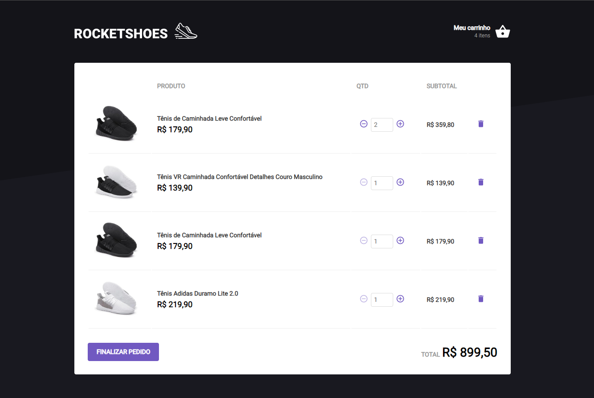

## 🎯 Sobre
<p>
  Ecommerce Web using React. The app was created in Rocketseat Ignite course.
</p>

## :eyes: Layout
### Home


### Cart


## :octocat: Run the app in localhost
- Requirements: Install [Git](https://git-scm.com/), [Node](https://nodejs.org/en/)
- Up the App and to enter the folder
```bash
$ git clone https://github.com/FelipenKniess/ignite-carthook.git
$ cd ignite-carthook
```
- Up dependecies and run the project
```bash
$ npm i
$ npm start
```

- You need to run this command together with the app to list the products 
```bash
$ npm server
```
